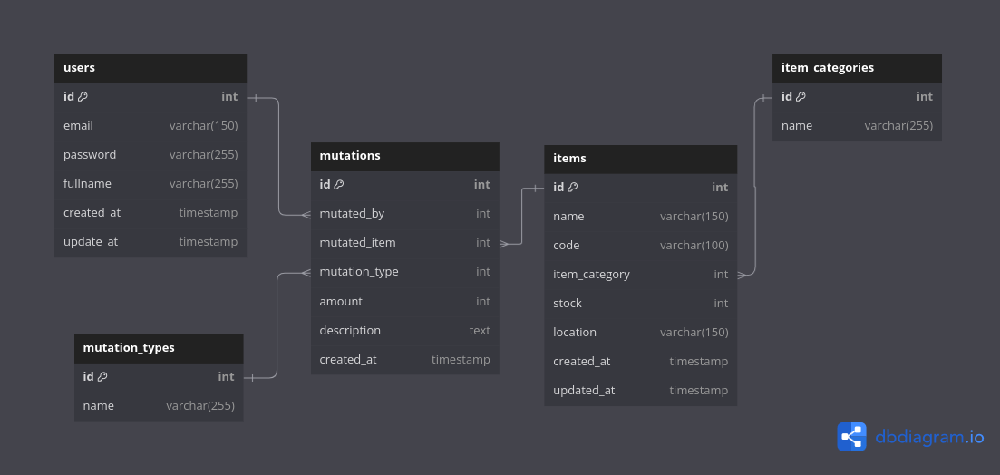

# ID-Grow Software Engineer Technical Test

## Setup
1. Make sure you already install docker in your host machine
2. Clone this repository
```zsh
https://github.com/devanfer02/id-grow-swe-test.git #https
git@github.com:devanfer02/id-grow-swe-test.git #ssh
```
3. Change directory the project dir
```zsh
cd id-grow-swe-test
```
4. Spin up the containers with this command, the application is running on port :80 so make sure your port :80 is free to use
```zsh
docker compose up -d
```
5.Visit the [localhost/api/health](http://localhost/api/health)

## Database Design



## Postman Documentation

For API documentation, you can see it from this [link](https://documenter.getpostman.com/view/27789368/2sAXqv5LjS)

## Features
1. Authentication (Login/Register)
2. Update user profile
3. Fetch user profile
4. Delete user
5. Fetch all items
6. Fetch item by id with mutations
7. Add item
8. Update item
9. Delete item

## TechStack

[](https://skillicons.dev)
